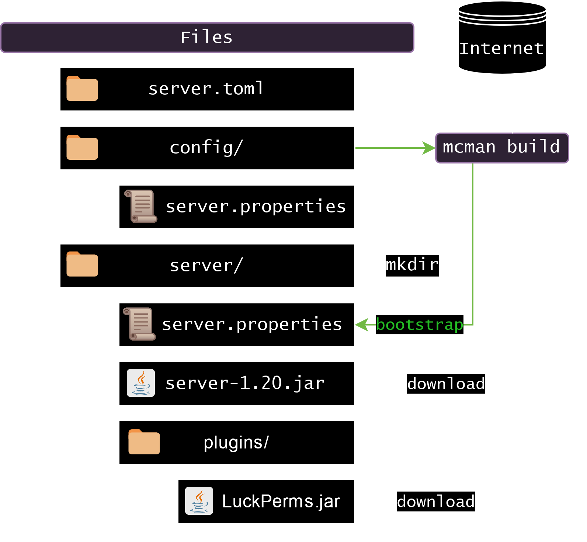

# Building, Running and Developing

After editing `server.toml` or writing configuration files to `config/`, you're probably going to want to run the server.

mcman is not designed to handle running the server itself, but provides a `run` and a `dev` command which we'll explain later.

## Building

To start the server, you need the files. The `.jar` files of the server, addons, and other stuff. We call the process of downloading, processing, copying etc. **building**.

Building requires a valid [server.toml](../reference/server.toml.md) file - thats it.

To not conflict with everything else, the build output folder is by default the `server/` directory, next to `server.toml` and `config/`. This folder should already be `.gitignore`d by default.

You can override the output directory with the `--output <path>` option, but this is not recommended.

You can also skip some steps if you want using the `--skip`/`-s` option. Possible values are `plugins`, `mods`, `worlds` and `bootstrap`. If you need to skip multiple stages, stack them up like so: `-s mods -s worlds`

### Overview

1. Server jar is downloaded (or [installed](#java))
2. Addons (plugins and mods) are downloaded
3. Worlds are [unpacked or downloaded](./using-worlds.md) if they dont exist
4. Datapacks are downloaded
5. Files get [bootstrapped](./variables.md) with variables (`config/` -> `server/`)
6. [Launch scripts](../reference/server-launcher.md) are created

### Java

Some servers (quilt, forge, neoforge, spigot/bukkit) require **java** to be present while building. This is because those server types use an installer mechanism instead of providing a pre-built `server.jar` file that mcman can download.

If the server type is one that requires installation, you can find the installer's output logs under the output directory. The file name is `.S.mcman.log` where `S` is a short identifier for the installer. (`qsi` for quilt, `bt` for buildtools, `fi` and `nfi` for forge/neoforge respectively)

The installer must exit with a non-zero code or mcman considers it a fail and stops building the server.

## Running

The recommended approach is running the server on your own using something like Docker. But there is a way to make mcman run the server. The `mcman run` command first builds the server, then runs it.

!!! tip
    The `mcman run` command accepts the options of `mcman build` too.

!!! note "Testing the server"
    You can use the `--test` option to test if your server works. mcman will build and run the server and see if it fully starts up. If it crashes, stops, or doesnt succeed, mcman will report the issue and exit with code `1`.

    If `options.upload_to_mclogs` is `true` in `server.toml`, mcman will upload `latest.log` and the crash log (if it crashed) to [mclo.gs](https://mclo.gs/) and print the URL to the console.

    You can use CI/CD to test if your server works. For example, [this](https://github.com/ParadigmMC/mcman-bc23/blob/1938a567a2324607d816f17481e49c922af1ed87/.github/workflows/bc23test.yml) is a github workflow that tests if the BlanketCon 23 server boots up successfully.

## Developing

Please see [Development Sessions](./dev.md)
